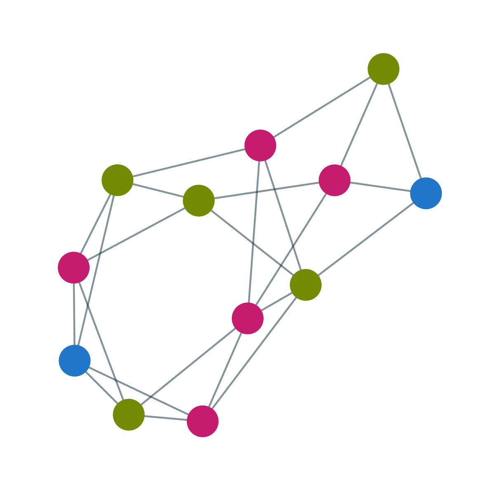

Aside
================================================================================

{width=80%}

Contact {#contact}
--------------------------------------------------------------------------------

- <i class="fa fa-envelope"></i> cgilroy@uw.edu
- <i class="fa fa-globe"></i> [ccgilroy.com](https://ccgilroy.com)
- <i class="fa fa-github"></i> [github.com/ccgilroy](https://github.com/ccgilroy)
- <i class="fa fa-twitter"></i> [\@ccgilroy](https://twitter.com/ccgilroy)
- <i class="fa fa-phone"></i> 731-225-0001

Skills {#skills}
--------------------------------------------------------------------------------

**Programming:**  
R, Python, Stan, SQL

**Data science:**  

- Statistical modeling and data visualization of survey, network, spatial, and text data 
- Designing and weighting complex surveys 
- Combining disparate data sources, including from web-scraping, APIs, and Hive tables

Workshops 
--------------------------------------------------------------------------------

**CSS workshops organized:**  

- [SICSS-Seattle](https://compsocialscience.github.io/summer-institute/2018/seattle/) (2018)  
- [IUSSP training workshop on digital demography](https://github.com/CSDE-UW/IUSSP-digital-demog-2017) (Cape Town, 2017)  
- [Computational Demography Working Group](https://csde-uw.github.io/computational-demography/) (UW, 2018-2020)  
- [Word Embeddings for the Social Sciences](https://ccgilroy.github.io/word-embeddings-workshop/) (2021)

Disclaimer {#disclaimer}
--------------------------------------------------------------------------------

This resume was made with the R package [**pagedown**](https://github.com/rstudio/pagedown).

Last updated on `r Sys.Date()`.

Main
================================================================================

Connor Gilroy {#title}
--------------------------------------------------------------------------------

### Computational sociologist & PhD student

Education {data-icon=graduation-cap data-concise=true}
--------------------------------------------------------------------------------

### PhD, Sociology 

University of Washington

Seattle, WA

expected 2023 - 2018

<!-- Comprehensive Exam: "Community: Origins, Processes, and Consequences." *Passed with distinction, June 2019* -->

- Certificate: Special Concentration in Social Statistics. *May 2019*

### MA, Sociology

University of Washington

Seattle, WA

2018 - 2015

- Thesis: "How Distinct is Gay Neighborhood Change? Patterns and Variation in Gayborhood Trajectories." *Distinguished Thesis Award in Social Sciences, 2019*

### BA, Biology and Geophysical Sciences

University of Chicago 

Chicago, IL

2013 - 2009

<!-- Minor in Gender and Sexuality Studies -->

Experience {data-icon=laptop}
--------------------------------------------------------------------------------

### Graduate Research Assistant

University of Washington 

Seattle, WA

present - 2015

- Agent-based network models (with Katherine Stovel), text and network community detection (with Zack Almquist) | **R, Python, NetLogo**

### User Experience Research Intern

Facebook

Seattle, WA

2021, 2020

- Complex survey of job seeker needs and satisfaction (2021) | **R, Python, SQL**
- Quantitative studies of participation in new communities (2020) | **R, SQL**

### Consultant, Survey Data Analysis

The World Bank Group

Washington, DC

2020

- Modeling and visualization of gender-based disparities in Central Asia | **R**

### Graduate Teaching Assistant & Instructor

University of Washington 

Seattle, WA

2020 - 2016

- Sections and courses taught: sociological theory, data and society (undergraduate), social statistics, data science and population processes, Bayesian statistics for the social sciences (graduate) | **R, Stata, Stan**

### Quality Assurance

Epic Systems Corporation 

Verona, WI

2015 - 2013

- Automated and manual software testing | **C#, Python, Excel**

Selected Publications {data-icon=book}
--------------------------------------------------------------------------------

### Digital Traces of Sexualities: Understanding the Salience of Sexual Identity through Disclosure on Social Media

N/A

N/A

2021

**Gilroy, Connor** and Ridhi Kashyap. *Socius* 7: 1--18. [doi: 10.1177/23780231211029499](https://doi.org/10.1177/23780231211029499)

### Humans in the Loop: Incorporating Expert and Crowdsourced Knowledge for Predictions using Social Survey Data 

N/A

N/A

2019

Filippova, Anna, **Connor Gilroy**, Ridhi Kashyap, Antje Kirchner, Allison C. Morgan, Kivan Polimis, Adaner Usmani, and Tong Wang. *Socius* 5: 1--15. [doi: 10.1177/2378023118820157](https://doi.org/10.1177/2378023118820157). (corresponding author)

